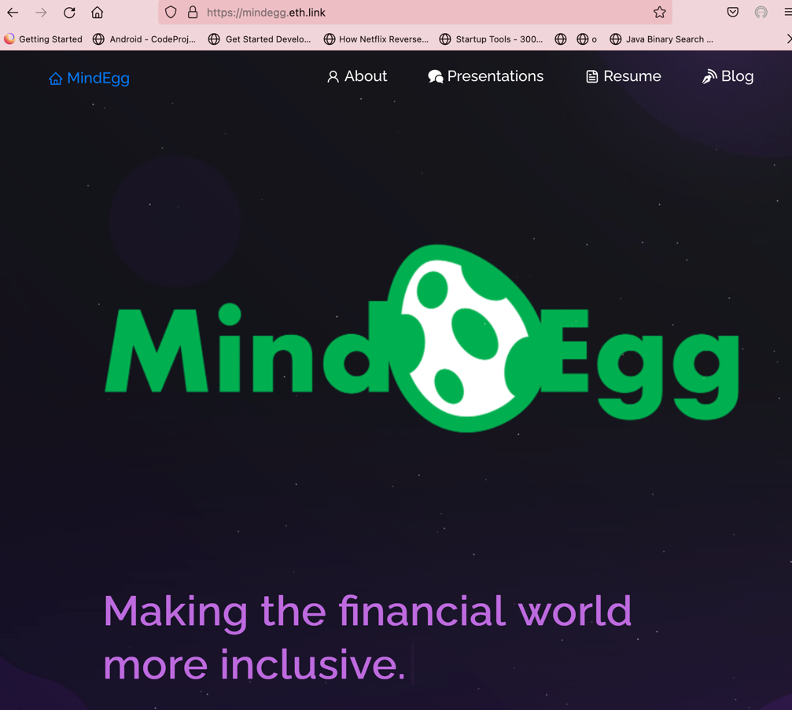

# Mindegg
Check the live version at https://mindegg.eth.link

## Uploading this to IPFS and Connecting it to a ENS
### Buy ENS
1) Buy a ENS URL on https://ens.domains/
2) Go to the app and connect your crypto wallet to the app
3) See if your URL is available to purchase, and purchase it using the Eth in your wallet

### Deploy to IPFS
1) Push out your project to your Github Repo
2) Go to Fleek (https://fleek.co/) 
3) Add a new site and connect to your Github Repo
4) Search for your project's repo
5) Select IPFS as the hosting service
6) Select React as your framework and select Deploy site
7) Once your Deployment is complete go to Settings
8) Domain Management and then ENS
9) Create a Content Hash for your ENS, it will cost you ETH and will require your wallet
10) Wait a few minutes, if you go to the URL too early you will see the error (ipfs resolve -r could not resolve name)
11) Go to your URL, it will have .link at the end of it, for example the ENS I own is mindegg.eth and will be mindegg.eth.link

## Local Setup
Go to your project directory and ente

`npm install`

Once all the dependencies are installed start your app by running:

`npm start`

## Special Thanks:
Soumyajit Behera
https://github.com/soumyajit4419/

